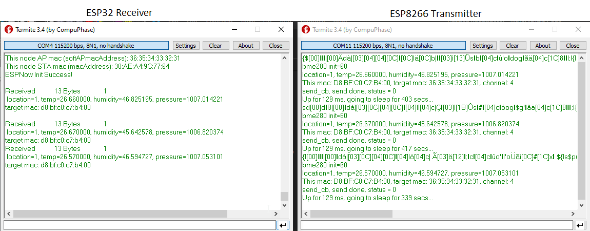

# ESPNow
 
Simple ESPNow demo with ESP8266 client sending to ESP32 Gateway

## Client

running on ESP8266 (tested on Wemos D1 mini)

ESP8266 client with BME280 temperature/pressure/humidity sensor which sends readings every xx minutes to a server with a fixed mac address via ESPNow

Based on code by: Anthony Elder @ [HarringayMakerSpace](https://github.com/HarringayMakerSpace/ESP-Now)  
License: Apache License v2

RAM:   [===       ]  34.3% (used 28092 bytes from 81920 bytes)  
Flash: [===       ]  26.6% (used 277312 bytes from 1044464 bytes)

## Gateway

running on ESP32 (tested on generic DevKit v4 board)

ESP32 gateway which receives data from ESP8266 client node with BME280 sensor via ESPNow

Waits to be sent readings every xx minutes from client with a fixed mac address

Most of the code for ESPNow on ESP32 I found just didn't work, finely got it working thanks to useful pointers in these 2 articles:
https://www.reddit.com/r/esp32/comments/9jmkf9/here_is_how_you_set_a_custom_mac_address_on_esp32/  
https://randomnerdtutorials.com/esp-now-esp32-arduino-ide/
